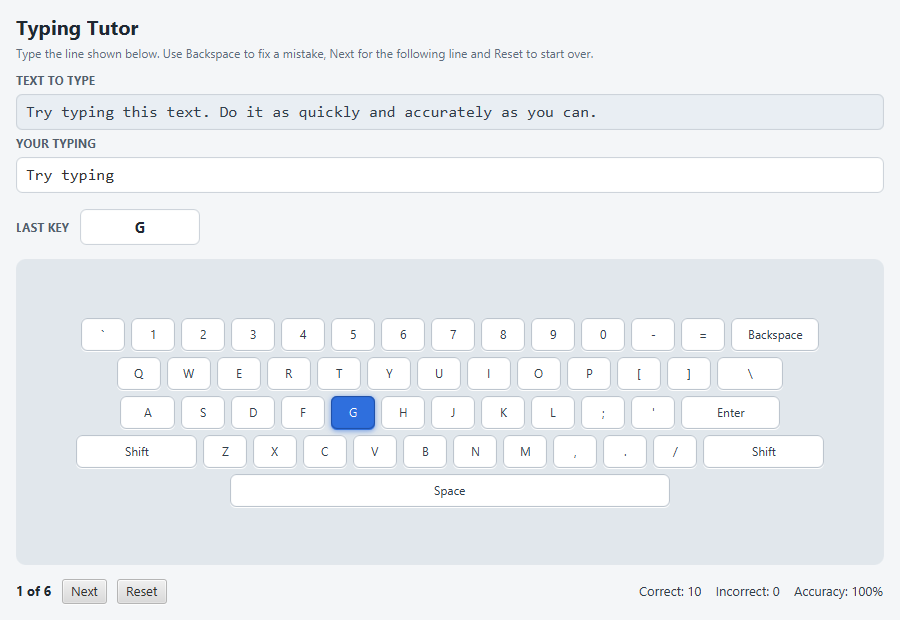

# Typing Tutor

Assignment 01 — Program Development in a Graphical Environment
Due September 25, 2026 · Prof. Nagat Drawel

A JavaFX desktop application that helps a user learn to touch type. The program
shows a line of sample text, echoes what the user types, lights up the matching
key on an on-screen keyboard, and reports how accurate the typing has been.

## Features

- A virtual keyboard built from JavaFX buttons: number row, three letter rows,
  both shift keys and the space bar.
- The practice line and the user's response are shown in separate text fields.
- Physical key presses are handled through `KEY_PRESSED`, `KEY_TYPED` and
  `KEY_RELEASED` events.
- The matching virtual key is highlighted while the physical key is held down
  and returns to normal when it is released.
- A label shows the value of the last key pressed. Keys the application does
  not model report **Not handled** in red.
- **Next** moves to the following practice line, clears the response and
  updates the `1 of 6` indicator.
- **Reset** returns to the first line, clears the response and zeroes the
  counters.
- Correct and incorrect keystrokes are counted and shown with a running
  accuracy percentage.
- Backspace removes the last character and withdraws its contribution to the
  counters, so corrections are not double-counted.

## How to use it

1. Run the program. The first practice line appears under **TEXT TO TYPE**.
2. Type the line on your physical keyboard. Characters appear under
   **YOUR TYPING** and the matching virtual key lights up.
3. Press Backspace to undo a mistake.
4. Press **Next** for the following line, or **Reset** to start again from
   line 1.

## Design

| Class | Responsibility |
| --- | --- |
| `App` | Builds the window, loads the stylesheet, starts the application. |
| `TypingTutorPane` | Lays out the interface and routes key events to the session. |
| `TypingSession` | Tracks the current line, the typed response and progress. |
| `TypingStats` | Counts correct and incorrect keystrokes, supports undo. |
| `TypingTexts` | Holds the six practice lines from the handout. |
| `VirtualKeyboard` | Builds the on-screen keyboard and looks keys up by code. |
| `VirtualKey` | One on-screen key; knows its `KeyCode` and its lit state. |

Keyboard input is handled in two stages. `KEY_PRESSED` and `KEY_RELEASED`
identify the physical key, which is what drives the highlight, the last-key
label and the *Not handled* message. `KEY_TYPED` supplies the character itself,
already adjusted for the shift state, which is what gets scored against the
practice line.

The response field is read-only and is filled from the application's own
handlers rather than by the text field's built-in editing, so every keystroke
passes through `TypingSession` and is counted exactly once.

## Requirements

- JDK 21 or newer
- Maven 3.8 or newer (bundled with Apache NetBeans)
- JavaFX 21 — resolved automatically by Maven, no separate SDK needed

## Build and run

In NetBeans, open the project and choose **Run Project**.

## Generating the API documentation

The generated documentation is written to `target/site/apidocs/index.html`.

## Author

Kian Dehghani
